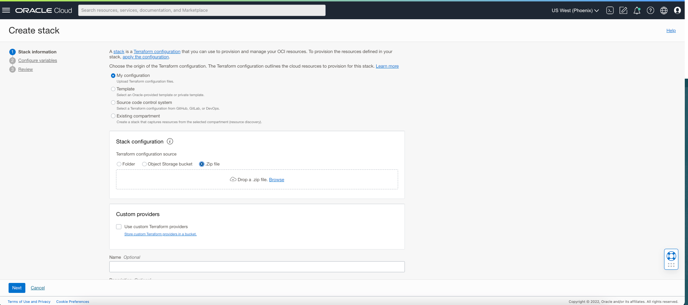
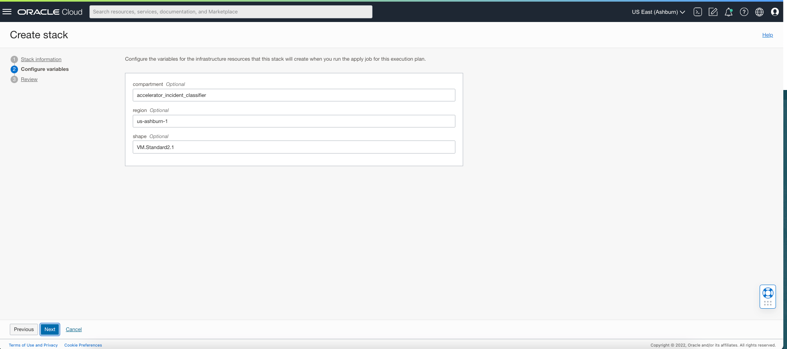
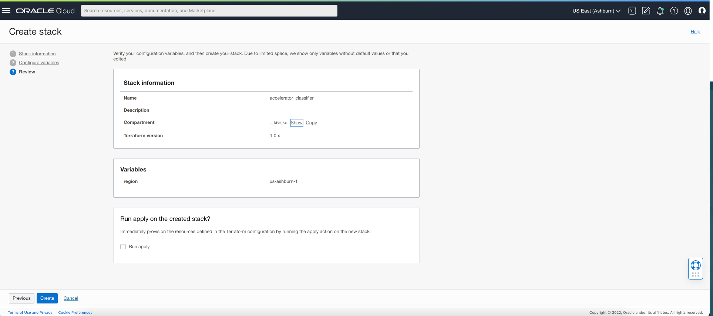
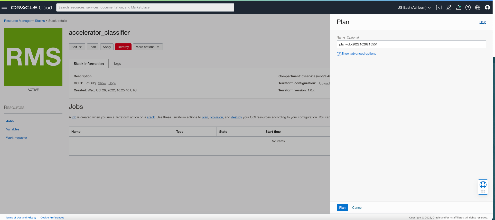
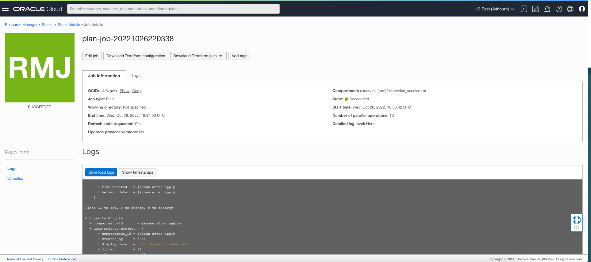
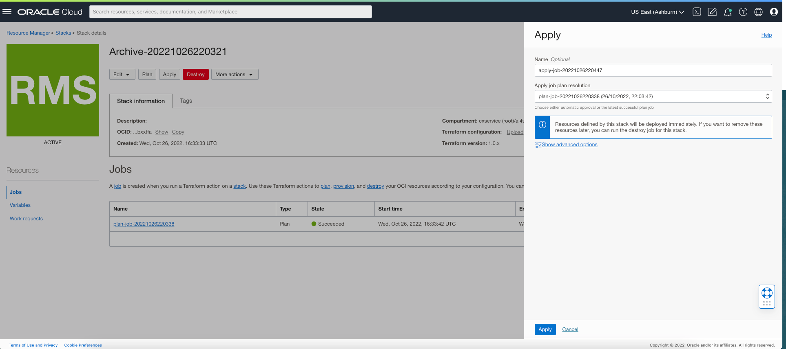

### Setup Resources for Incident Classifier through Terraform CLI

#### Prerequesites
- Compress src folder under classifier folder.
- Download condapackage and move it to terraform folder.


#### Step 1:
- Please install terraform from [here](https://learn.hashicorp.com/tutorials/terraform/install-cli)
#### Step 2:
- Change the current directory to [terrafom](../terraform) folder
#### Step 3:
- Init terraform by executing ```terraform init``` from terminal
#### Step 4:
- destroy previously created [If exists] terraform by executing ```terraform apply -destory``` from terminal
#### Step 5:
- create terraform plan by ```terraform plan -out tf.plan``` from terminal
#### Step 6:
- Apply to terraform plan by ```terraform apply "tf.plan"``` from terminal
    

### Setup Resources for Incident Classifier through Oracle Stack

##### Step 1: Go to Resource Manager and Select Stack
##### Step 2: Click on Create Stack and Upload .zip file (incident-classifier codebase) there (contails only .tf files)

##### Step 3: Please provide required configuration details. Such as compartment to be, group name to be etc.

##### Step 4: Verify given configuration details and click create.

##### Step 5: Click on "Plan"

##### Step 6: Verify that what resources are going to be created.

##### Step 7: Apply the created plan

##### Step 8: Check logs to check what resources are created

##### Step 9: If you want to rollback then destroy the stack by clicking "Destroy". It will destroy created resources.

